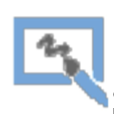

# 🗺️ CaveSketch

🌍 Lingue disponibili: [🇬🇧 English](README.md) | [🇮🇹 Italiano](README.it.md)

**Disegna le tue poligonali in pochi secondi — direttamente da TopoDroid!**
Niente più software pesanti, niente più configurazioni complicate. Solo file DXF, un browser e la tua prossima spedizione.

🔗 **Provalo subito**: [CaveSketch Live App](https://cave-sketch.streamlit.app/)  
(Sostituisci questo con l'URL reale!)

## 🚀 Cos'è CaveSketch?

CaveSketch è un'app semplice, veloce e ottimizzata per dispositivi mobili, costruita con Streamlit, che aiuta gli speleologi a generare disegni **direttamente dai file `.dxf` di TopoDroid**.

Che tu sia sul campo o appena tornato al campo base, puoi:
- 🖨️ **Esportare pianta e sezione in PDF** puliti a partire dai tuoi schizzi di TopoDroid.
- 🌍 **Posizionare la mappa della grotta su immagini satellitari**, usando coordinate GPS note.
- 📱 **Usarla direttamente dal telefono** — ti basta una connessione internet.

Niente Csurvey, niente QGIS, niente mal di testa.

--- 

## 🧭 Funzionalità

### ✅ Genera rilievo in PDF

- Carica i file `.dxf` esportati da TopoDroid (pianta e/o sezione).
- Personalizza scala, rotazione, dimensione del testo, spessore delle linee, ecc.
- Esporta un **PDF pulito il rilevo della grotta**.

### ✅ Sovrapponi su mappa satellitare

- Sovrapponi la mappa su un'immagine satellitare usando punti GPS noti.
- Esporta una **mappa interattiva in `.html`** pronta da condividere o consultare offline.

---

## 📸 Come si usa

### 1. Esporta i tuoi schizzi da TopoDroid come file **.dxf**

- Dalla finestra principale del progetto in TopoDroid, tap sul pulsante di modifica schizzi  e seleziona la pianta della grotta.
- Tap sui 3 puntini in alto a sinistra e seleziona `Export`.
- Scegli l'opzione DXF e tocca `Save`.
- Allo stesso modo esporta anche la sezione della grotta.

<div style="display: flex; gap: 10px; justify-content: space-between;"> 
     
     
     
</div>

### 2. 🗺️ Crea il rilievo su mappa
- Carica i file DXF esportati nell'app. Nota: non è necessario caricare entrambi i file, solo quello di tuo interesse (pianta o sezione).
- Personalizza le impostazioni (scala, rotazione, dimensione del testo, ecc.)
- Clicca su **✨ Generate Survey Plot**
- Se il risultato ti soddisfa, scarica il tuo **PDF**!

### 3. 🌍 Posiziona la grotta su immagine satellitare
- Inserisci punti GPS noti relativi alle stazioni di rilievo per georeferenziare la mappa.
- Puoi aggiungere quanti punti vuoi (più sono, meglio è).
- Clicca su **🌍 Generate Geo Map** per generare la mappa con vista satellitare.

--- 

## 💻 Per sviluppatori

### 🔧 Esegui localmente

```bash
git clone https://github.com/LorBordin/cave_sketch.git
cd cavesketch
pip install -r requirements.txt
streamlit run app.py
```

### 🧑‍💻 Contribuisci
Hai trovato un bug? Hai un'idea? Le pull request sono benvenute!
Per contribuire:

1. Fai il fork del repository
2. Crea un nuovo branch
3. Committa le modifiche
4. Apri una pull request 🚀

### 📋 Cose da fare (aperto ai contributi)

Aiutaci a rendere CaveSketch ancora migliore!
- 🎨 Aggiungere opzione per colorare aree, non solo linee
- 🛰️ Migliorare il rendering della mappa satellitare in HTML
- 🌍 Aggiungere supporto all’esportazione in formato .kml (Google Earth)
- ➕ Permettere l’unione di più rilievi in un unico file .kml
- 🧊 Disegnare ed esportare modelli 3D delle grotte