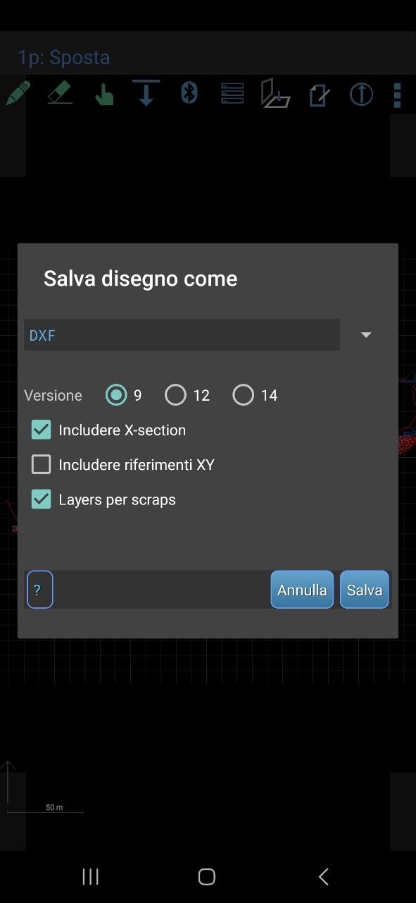

# 🗺️ CaveSketch

🌍 Available languages: [🇬🇧 English](README.md) | [🇮🇹 Italiano](README.it.md)

**Draw your cave surveys in seconds — directly from TopoDroid!**  
No more heavy tools, no more painful setups. Just DXF files, a browser, and your next expedition.

🔗 **Try it now**: [CaveSketch Live App](https://your-deployed-app-url.com)  
*(Replace this with the real URL!)*

---

## 🚀 What is CaveSketch?

CaveSketch is a simple, fast, and mobile-friendly app built with Streamlit that helps cavers generate survey plots **directly from TopoDroid's `.dxf` files**.

Whether you're in the field or just back at base camp, you can:
- 🖨️ **Export clean PDF maps and sections** from your TopoDroid sketches.
- 🌍 **Place cave maps on satellite imagery**, using known GPS coordinates.
- 📱 Use it **directly from your phone** — all you need is an internet connection.

No Csurvey, no QGIS, no headaches.

---

## 🧭 Features

### ✅ Generate PDF Survey
- Upload `.dxf` files from TopoDroid (map and/or section).
- Customize scale, rotation, text size, line width, etc.
- Export a polished **PDF with your cave map and/or section**.

### ✅ Draw on Satellite Map
- Overlay your cave map on a satellite image using entrance GPS points.
- Export an interactive **.html map** ready to share or view offline.

---

## 📸 How To Use

### 1. Export your sketches from TopoDroid as **.dxf** files
   - From the project main window in TopoDroid, tap on the Sketch Editing button  and select the cave map
   -  Tap on 3 buttons on Top Left and tap `Export`
   - Select the DXF option and tap on `Save`
   - In the same way export the cave section

<div style="display: flex; gap: 10px; justify-content: space-between;">
  
  
  
</div>


### 2. 🗺️ Create the survey on the map
   - Upload the exported DXF files on the app. Notice: there is no need to upload both files, in case you are interested only on the map or the section.
   - Customize the settings (scale, text size, rotation, etc.)
   - Click **✨ Generate Survey Plot**
   - If you are satisfied, download your **PDF**!

### 3. 🌍 Position the cave map on satellite imagery.
   - add known GPS points for survey stations to georeference your map.
   - add as many knwon points as you want (the more the better)
   - click on **🌍 Generate Geo Map** to generate a satelite view map.

---

## 💻 For Developers

### 🔧 Run Locally

```bash
git clone https://github.com/LorBordin/cave_sketch.git
cd cavesketch
pip install -r requirements.txt
streamlit run app.py
```

### 🧑‍💻 Contribute
Found a bug? Got an idea? PRs welcome!
To contribute:

1. Fork the repo
2. Create a new branch
3. Commit your changes
4. Open a pull request 🚀

### 📋 ToDo List (Open for Contributors)
Help us make CaveSketch even better!

- 🎨 Add option to color areas, not just draw lines
- 🛰️ Improve satellite HTML map rendering
- 🌍 Add support for .kml export (Google Earth)
- ➕ Allow adding surveys to an existing .kml file (merge drawings)
- 🧊 Draw and export 3D cave models