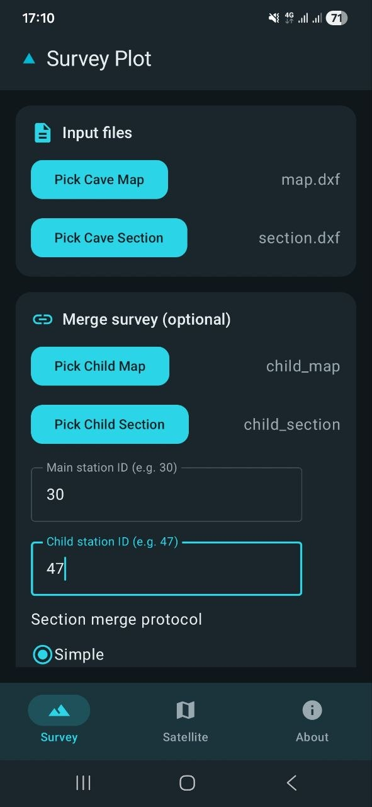
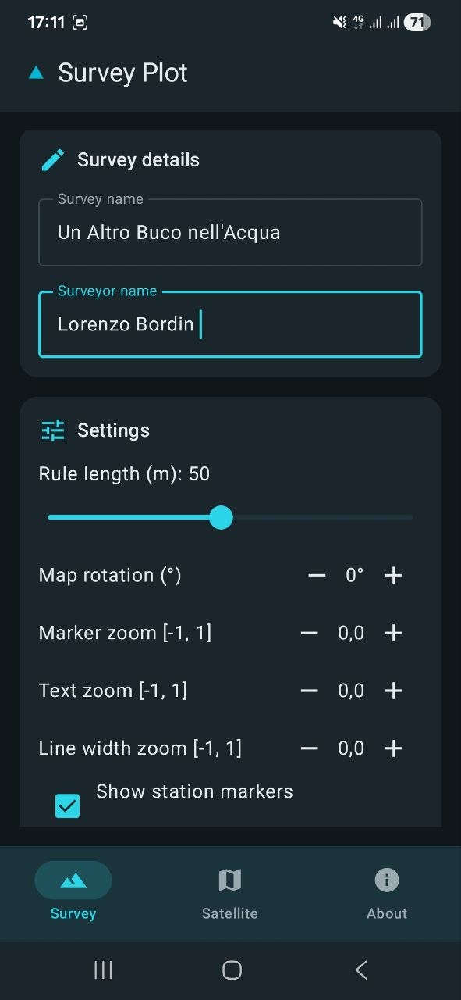
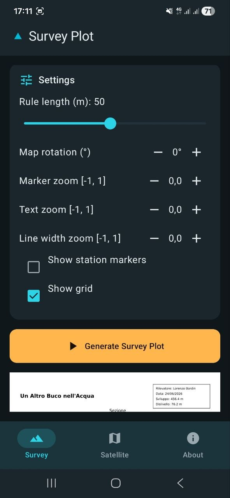
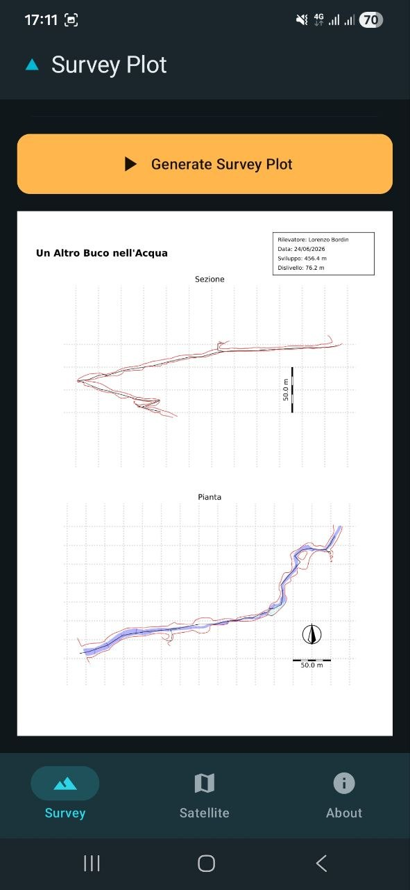
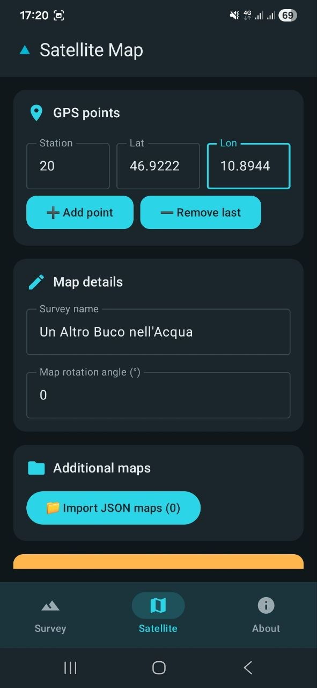
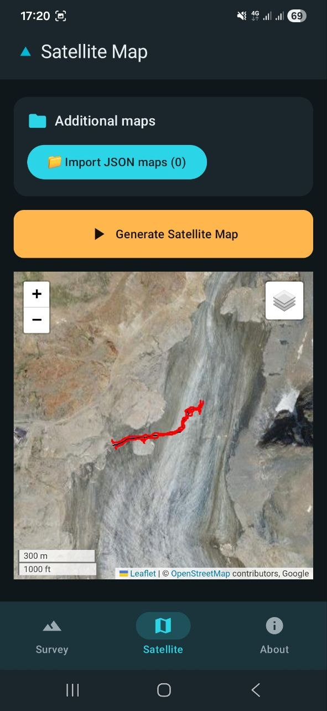
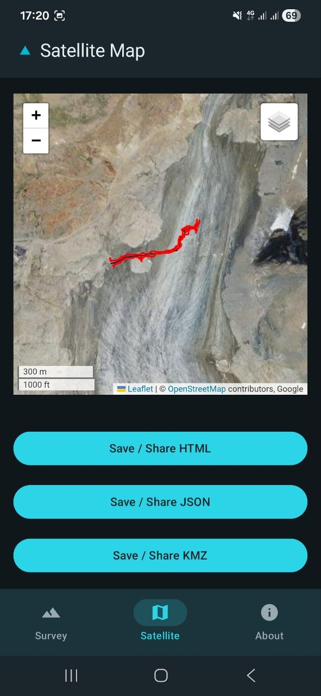
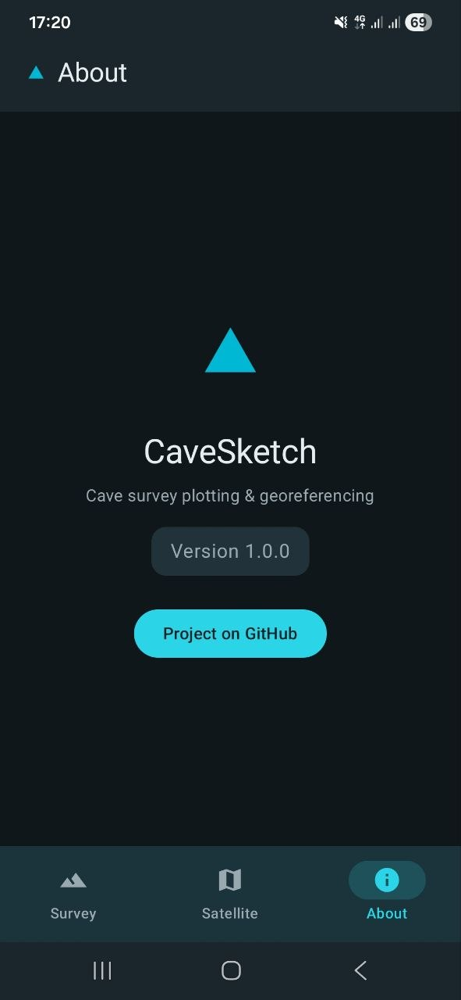

# CaveSketch per Android — Guida Utente

CaveSketch per Android è un'app nativa Android utilizzabile offline che sfrutta lo stesso motore Python di elaborazione rilievi dell'app web CaveSketch. Tutta l'elaborazione avviene **interamente sul dispositivo** — nessun server necessario.

---

## Le Tre Schermate

### 📋 Rilievo Topografico

Seleziona file DXF dal dispositivo e configura l'output del rilievo:

- **Nome rilievo** e **rilevatore**
- **Scala** e **lunghezza scala grafica**
- **Rotazione**
- **Zoom marcatori / testo / spessore linee**
- **Marcatori stazione** e **griglia**
- Unione opzionale con un **rilievo figlio** (ID stazione + protocollo sezione)

Tocca **Genera** per produrre un'anteprima PDF, poi **Salva** o **Condividi** il risultato.

---

### 🌍 Mappa Satellitare

Aggiungi punti di riferimento GPS (ID stazione, latitudine, longitudine) e configura:

- **Nome rilievo** e **rotazione**
- Importazione opzionale di una **mappa JSON** per sovrapposizione multi-rilievo

Tocca **Genera** per produrre:

- **Anteprima HTML** (richiede connessione per i server di tile satellitari)
- **Esportazione JSON** (formato mappa grotta)
- **Esportazione KMZ** (per Google Earth)

**Salva** o **Condividi** ogni output in modo indipendente.

---

### ℹ️ Informazioni

Mostra la versione dell'app e fornisce un collegamento al repository GitHub.

---

## Comportamento Offline

| Funzionalità | Offline | Note |
|---|---|---|
| Generazione PDF | ✅ | Interamente sul dispositivo |
| Esportazione KMZ | ✅ | Interamente sul dispositivo |
| Esportazione JSON | ✅ | Interamente sul dispositivo |
| Anteprima HTML satellitare | 🌐 | Richiede connessione per i server di tile online |

> [!NOTE]
> Quando il dispositivo è offline, l'anteprima HTML satellitare mostra un banner **"No connection — satellite preview unavailable"**, ma le esportazioni KMZ e JSON vengono generate normalmente.
