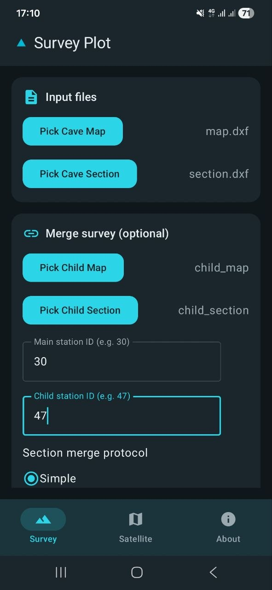
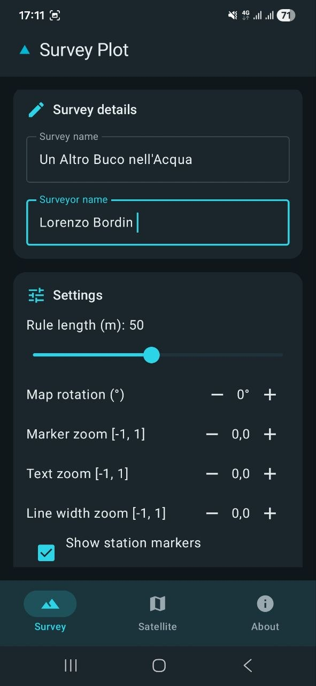
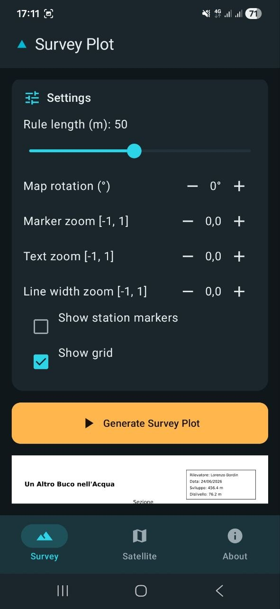
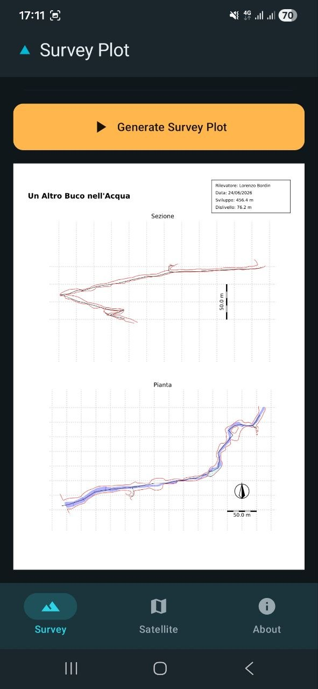
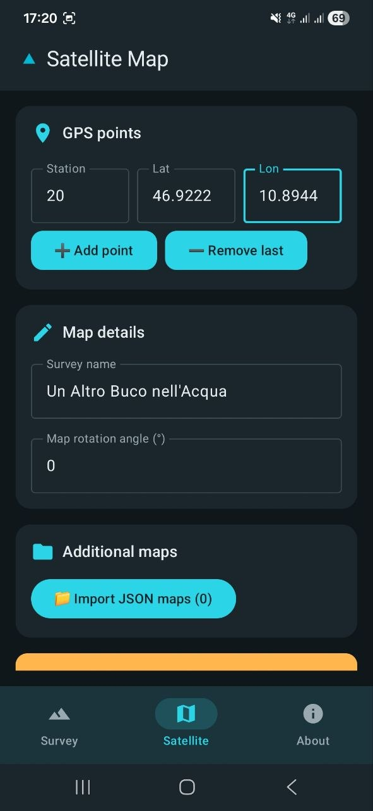
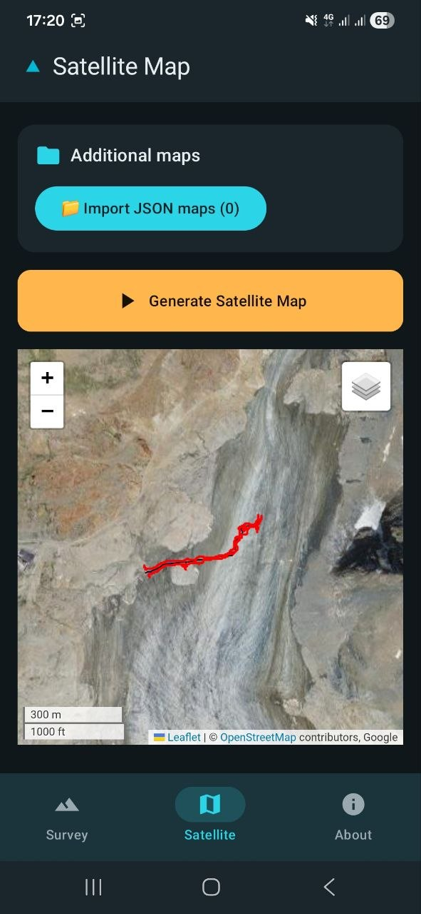
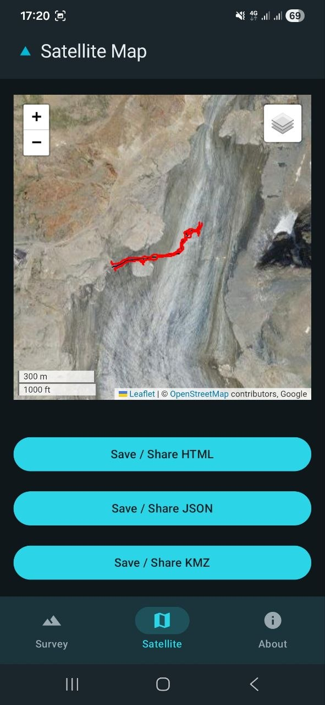
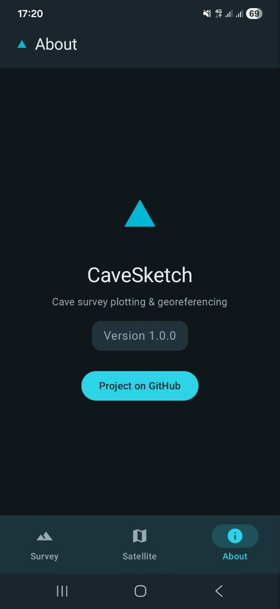

🌍 Available languages: [🇬🇧 English](README.md) | [🇮🇹 Italiano](README.it.md)

# CaveSketch for Android — User Guide

CaveSketch for Android is an offline-capable native Android app that uses the
same Python cave survey engine as the CaveSketch web app. All survey processing
happens **entirely on-device** — no server required.

---

## Installation

1. Download **`CaveSketch-1.0.0.apk`** from
   [GitHub Releases](https://github.com/LorBordin/cave_sketch/releases).
2. Android will ask you to allow installs from unknown sources.
   Enable in **Settings → Apps → Special access → Install unknown apps** and
   grant permission to your browser or file manager.
3. Tap **Install**.

> [!TIP]
> **Upgrades**: Simply download a newer APK and install it over the existing
> version — your settings are preserved (the APK uses the same signing key).

---

## The Three Screens

### 📋 Survey Plot

Pick DXF files from your device and configure the survey output:

- **Survey name** and **surveyor**
- **Scale** and **rule length**
- **Rotation**
- **Marker / text / line-width zoom**
- **Station markers** and **grid** toggle
- Optional **merge with a child survey** (station IDs + section protocol)

Tap **Generate** to produce a PDF preview, then **Save** or **Share** the
result.

---

### 🌍 Satellite Map

Add GPS reference points (station ID, latitude, longitude) and configure:

- **Survey name** and **rotation**
- Optional **JSON map import** for multi-survey overlay

Tap **Generate** to produce:

- **HTML preview** (requires network for satellite tile servers)
- **JSON export** (cave map format)
- **KMZ export** (for Google Earth)

**Save** or **Share** each output independently.

---

### ℹ️ About

Displays the app version and provides a link to the
[GitHub repository](https://github.com/LorBordin/cave_sketch).

---

## Offline Behavior

| Feature | Offline | Notes |
|---|---|---|
| PDF generation | ✅ | Fully on-device |
| KMZ export | ✅ | Fully on-device |
| JSON export | ✅ | Fully on-device |
| Satellite HTML preview | 🌐 | Requires network for online tile servers |

> [!NOTE]
> When offline, the satellite HTML preview shows a
> **"No connection — satellite preview unavailable"** banner, but KMZ and JSON
> exports still generate normally.

---

## For Contributors

Interested in how the app is built? See the
[Architecture & Tech Stack](architecture.md) document for technical details on
the Android-specific implementation.

---

[Back to main README](../../README.md)
