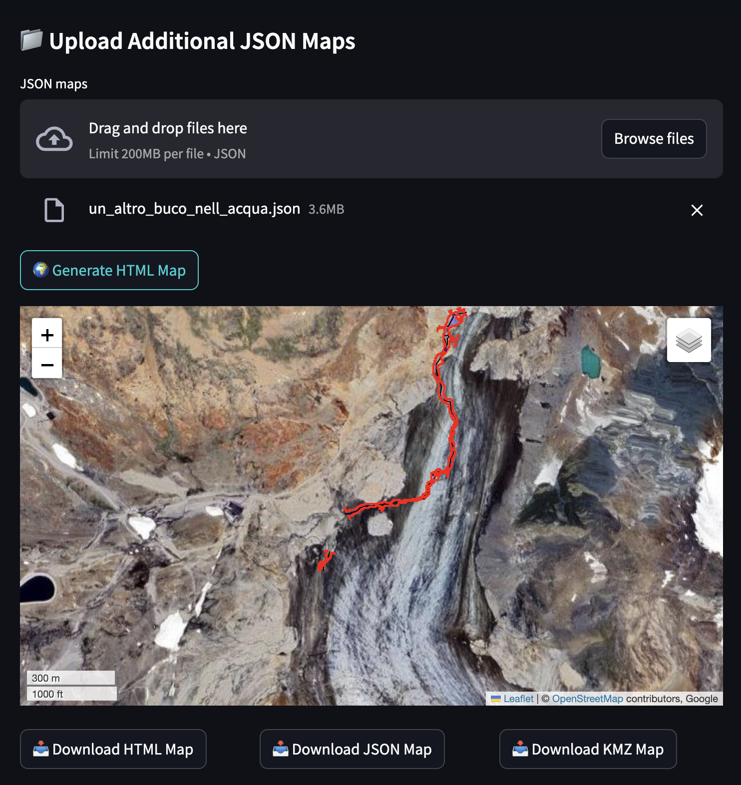
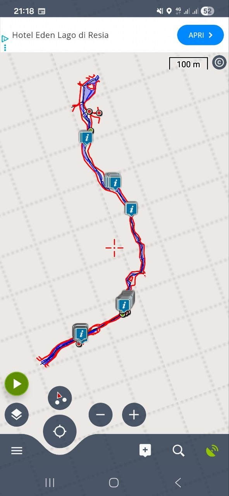

🌍 Lingue disponibili: [🇬🇧 English](satellite-maps.md) | [🇮🇹 Italiano](satellite-maps.it.md)

# Mappe Satellitari, Viste Multi-Rilievo & Esportazione KMZ Offline

CaveSketch può sovrapporre il rilievo della grotta su immagini satellitari, combinare più rilievi in un'unica vista geografica ed esportare file mappa utilizzabili offline sul campo.

## Sovrapposizione Singolo Rilievo

Posiziona la mappa della grotta su immagini satellitari fornendo le coordinate GPS delle stazioni di rilievo note. CaveSketch calcola una trasformazione affine per allineare la geometria della grotta con la geografia reale.

> [!TIP]
> Più stazioni georeferenziate fornisci, migliore sarà la precisione della trasformazione affine. Due punti sono il minimo, ma tre o più migliorano significativamente il risultato.

## Rendering di Rilievi Uniti

Quando i rilievi vengono uniti nella pagina **Grafico Rilievo**, la mappa unita viene automaticamente utilizzata per la vista satellitare. Non è necessario alcun passaggio aggiuntivo — se i rilievi sono uniti, la sovrapposizione satellitare riflette il risultato combinato.

## Più Rilievi su un'Unica Mappa

È possibile visualizzare più rilievi indipendenti insieme su un'unica vista satellitare:

1. Genera una mappa satellitare per il primo rilievo.
2. **Esporta** quel rilievo come JSON dalla pagina satellitare.
3. Quando generi la mappa satellitare di un secondo rilievo, **importa** il JSON esportato in precedenza.
4. Entrambi i rilievi vengono disegnati sulla stessa vista. Ripeti per aggiungere altri rilievi.

## Formati di Output

CaveSketch produce tre formati di output dalla pagina satellitare:

| Formato | Uso |
|---------|-----|
| **HTML Interattivo** | Mappa basata su Folium per la consultazione in qualsiasi browser. Spostamento, zoom e attivazione livelli. |
| **KML** | Importazione in Google Earth per la visualizzazione 3D con terreno. |
| **KMZ** | Archivio autonomo per l'uso offline in app mobili come **Locus Map** o **OsmAnd**. |

## KMZ per Uso Offline — La Storia del Freeze-Fix

L'esportazione KMZ è stata riprogettata per risolvere un problema critico di prestazioni con le app di mappe mobili.

### Il Problema

L'esportazione KML originale produceva circa **6.211 Placemark** — uno per ogni segmento a due punti, con molti duplicati inversi. Il caricamento di questo file in Locus Map causava il blocco dell'app.

### La Soluzione

La nuova esportazione KMZ applica diverse ottimizzazioni:

- **Concatenamento segmenti** — Migliaia di segmenti brevi vengono ridotti a circa **5–7 polilinee lunghe**, diminuendo drasticamente il numero di Placemark.
- **Stili condivisi** — Una sola definizione `<Style>` per tipo di elemento, invece di stili inline su ogni oggetto.
- **Raggruppamento MultiGeometry** — Un Placemark con un blocco `<MultiGeometry>` per tipo di linea, invece di migliaia di Placemark individuali.
- **Poligoni acqua** — Renderizzati come Placemark `<Polygon>` individuali per una corretta visualizzazione del riempimento.
- **Nodi di tipo punto** — Stazioni di rilievo e altri elementi puntuali esportati come Placemark `<Point>`.
- **Zero chiamate di rete** — Il KMZ è completamente autonomo e funziona totalmente offline.
- **Tutte le mappe caricate** — L'esportazione è costruita da tutte le mappe JSON caricate, non solo dal rilievo corrente.

## Limitazioni Note

> [!NOTE]
> **OsmAnd** potrebbe visualizzare le aree d'acqua solo come contorni, senza poligoni riempiti. **Locus Map** le visualizza correttamente con riempimento completo dei poligoni.

---

[Torna alla documentazione Web](README.it.md)
