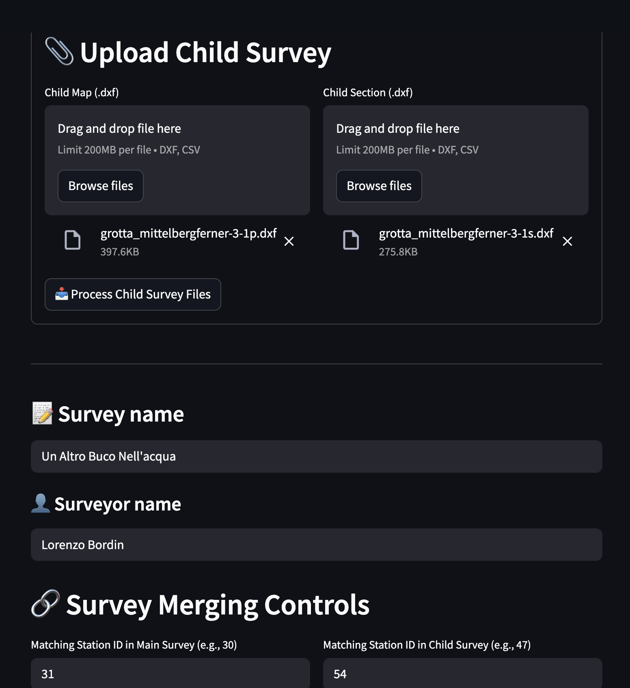
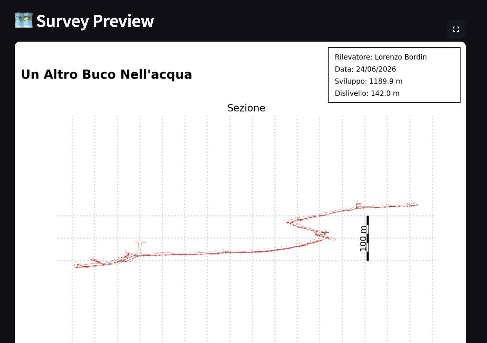
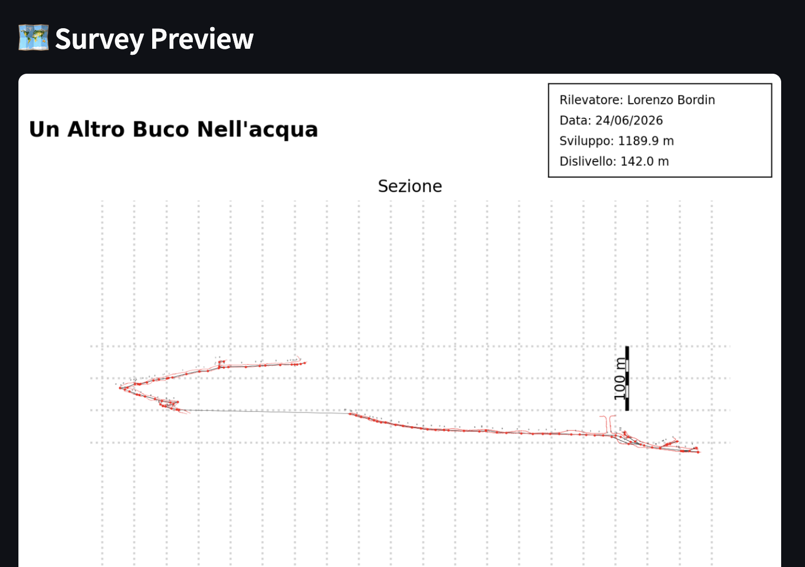

🌍 Available languages: [🇬🇧 English](survey-merging.md) | [🇮🇹 Italiano](survey-merging.it.md)

# Survey Merging — Combining Parent and Child Surveys

## Overview

CaveSketch lets you combine a **parent** survey with one **child** survey — map DXF and/or section DXF — into a single unified PDF plot.

## How It Works

On the **Survey Plot** page, below the main upload buttons, a merge section appears. The workflow is:

1. **Upload the child survey** — a map `.dxf` and/or a section `.dxf`.
2. **Specify matching station IDs** for parent and child (one pair that links the two surveys together).
3. A **single station ID pair** applies to both the map and section DXF, since the same TopoDroid project uses the same numbering.

> **Station ID format:** IDs must be purely numeric (e.g. `30`, `47`). IDs containing letters (e.g. `12P4`) identify wall or line geometry, not survey stations — they are rejected with a clear error message.

To merge additional surveys beyond one child, download the merged result and re-upload it as a new parent.

## Map View

Map view always uses **Simple Merging**: the child is translated so that its matching station coincides with the parent's matching station. No protocol selector is exposed for map view.

## Section View Protocols

For section view, you select a merging protocol via a radio/select control:

### Simple Merging

The child's matching station is aligned to the parent's matching station. Both surveys are drawn in the same coordinate space.

### Simple Mirror

Same as Simple Merging, but the child is **mirrored across the vertical axis (y-axis)** before placement. This is useful when surveys approach the junction from opposite directions.

### Displacement

The child is placed in a **separate, non-overlapping area**. The search direction is: right first, then below. Two thin connector lines are drawn from the parent's matching station to the child's matching station, visually linking the two survey segments.

## Settings & Rendering

All settings — rotation, scale, line width, text size, etc. — apply to the **whole merged result**. If the merged output exceeds the PDF page dimensions, it is automatically rescaled to fit.

## Error Handling

If a station ID is invalid (not found in the uploaded DXF), an inline error message is displayed and PDF generation is blocked until the issue is corrected.

---

[Back to Web Documentation](README.md)
